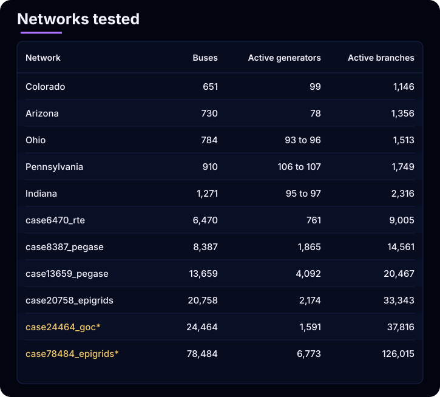
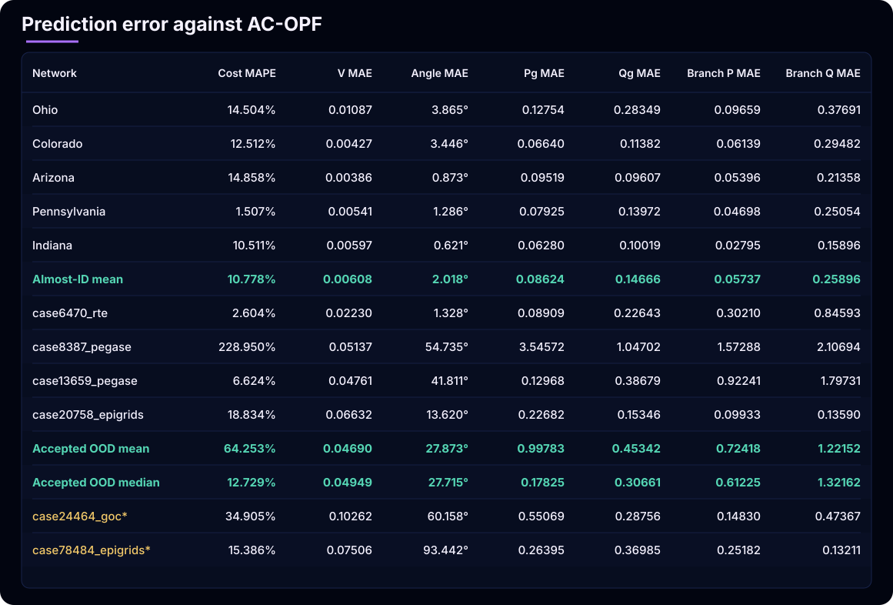
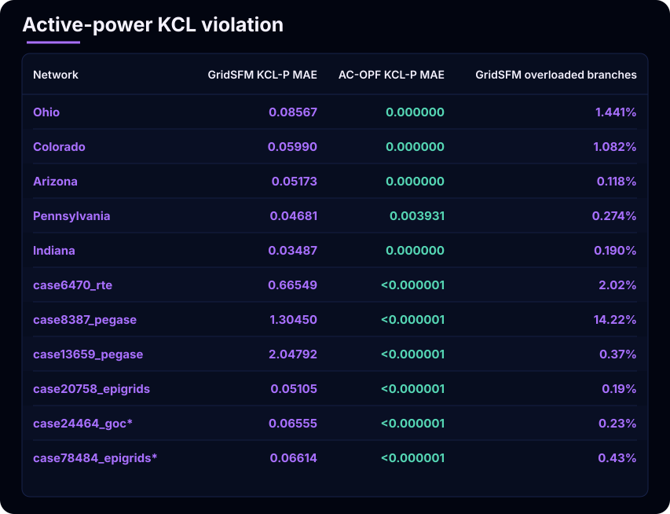
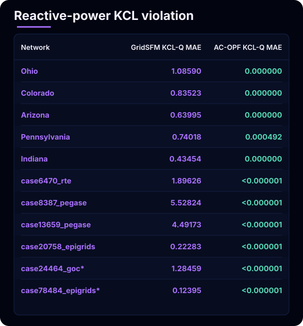
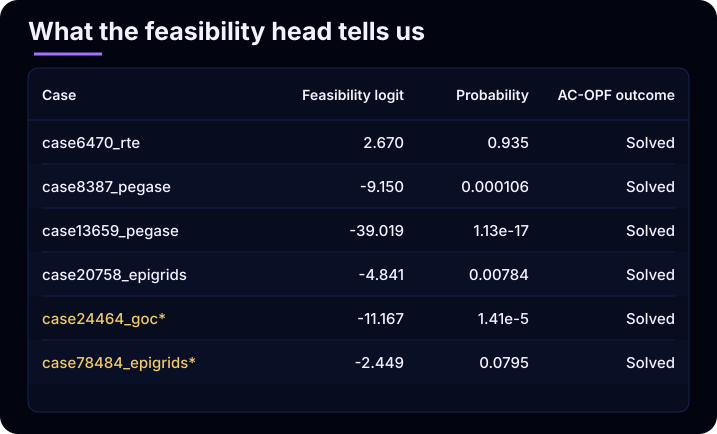
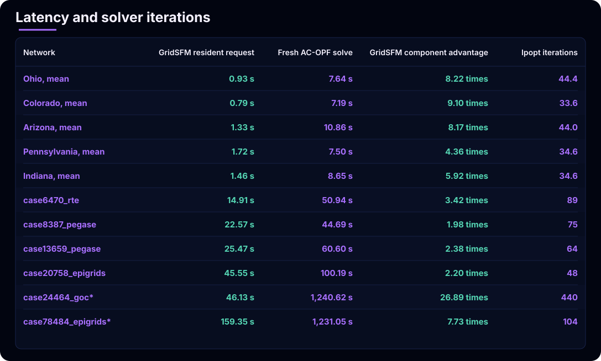

# Stress-testing GridSFM: from familiar grids to large zero-shot AC-OPF

Can a small neural model approximate [AC-OPF](https://powsybl.readthedocs.io/projects/powsybl-optimizer/en/stable/optimizer/acOptimalPowerflow.html) on grids far larger than anything it saw during training? We pushed GridSFM to its limits to find out.

GridSFM is Microsoft Research's roughly 15-million-parameter model for predicting bus voltages, generator dispatch, branch flows, and grid feasibility from topology and operating conditions.

Our evaluation uses an almost-ID perturbation set and a separate zero-shot topology-and-scale OOD set.

Microsoft open-sourced GridSFM, making these experiments possible. We thank the authors. This work stands on their shoulders, and we highly encourage readers to explore the [GridFM project page](https://www.microsoft.com/en-us/research/project/gridfm/) and [GridSFM white paper](https://www.microsoft.com/en-us/research/wp-content/uploads/2026/05/GridFM_white_paper.pdf).

## Two evaluation regimes

We tested GridSFM-Open v1.1 against AC-OPF references in two regimes.

The first is a validation-style, **almost in-distribution** cut. The [GridSFM white paper](https://www.microsoft.com/en-us/research/wp-content/uploads/2026/05/GridFM_white_paper.pdf) states that grids from Microsoft's open US-grid pipeline were used during pretraining. Our five grids come from that pipeline, so this experiment tests new perturbations on familiar, training-exposed topologies. It does not test unseen-grid generalization.

The second is a **zero-shot topology-and-scale shift** using large, unmodified networks from [PGLib-OPF](https://github.com/power-grid-lib/pglib-opf), the open benchmark introduced in the [PGLib-OPF paper](https://arxiv.org/abs/1908.02788). The [GridSFM white paper](https://www.microsoft.com/en-us/research/wp-content/uploads/2026/05/GridFM_white_paper.pdf) says PGLib and OPFData were among its training sources, so this is not source-family OOD. However, every tested graph exceeds GridSFM-Open's reported 4,661-bus training maximum. Two accepted cases exceed that maximum by more than 2 times, and the largest exploratory run reaches 16.84 times it.

This wording matters. “True OOD” would hide known overlap in data provenance. “Topology-and-scale shifted zero-shot evaluation” states exactly what the experiment establishes.

## Methodology

**Benchmark hardware:** all GridSFM runs used batch size one on CPU. The recorded machine had an Intel Core Ultra 7 155U, 30.87 GiB RAM, and no GPU.

### Almost-ID perturbation test

We started with Ohio, Colorado, Arizona, Pennsylvania, and Indiana models produced by Microsoft's open-data pipeline. That pipeline reconstructs OPF-solvable transmission models from public sources including OpenStreetMap, EIA data, and US Census data; its design is described in [*Building Power Grid Models from Open Data: A Complete Pipeline from OpenStreetMap to Optimal Power Flow*](https://arxiv.org/abs/2605.04289).

Following the perturbation families in Section 5 of the [GridSFM white paper](https://www.microsoft.com/en-us/research/wp-content/uploads/2026/05/GridFM_white_paper.pdf), we chained five transformations:

1. Load scaling and local demand jitter.
2. Generator outage.
3. Branch-rating derating.
4. Voltage-limit tightening.
5. Generator-cost reshuffling.

Each scenario started from a fresh base grid. Every transformation had its own activation rule, so one scenario could contain several simultaneous changes. We sampled until five AC-OPF-solvable scenarios were accepted for each topology: 25 scenarios total.

The accepted samples realized system load factors from 0.8014 to 1.2408. Generator outages appeared in 3/25 scenarios, branch derating in 2/25, voltage tightening in 1/25, and cost reshuffling in all 25.

### Large PGLib zero-shot test

For scale-shifted evaluation, we used vanilla PGLib-OPF base cases without further perturbation. PGLib-OPF was created as an open, standardized benchmark library for AC-OPF algorithms; see [*The Power Grid Library for Benchmarking AC Optimal Power Flow Algorithms*](https://arxiv.org/abs/1908.02788).

Before accepting a PGLib case into the aggregate, we used a source-to-PyG round-trip check:

1. Solve AC-OPF on the original PGLib case.
2. Export the solved case into GridSFM's PyG representation.
3. Reconstruct the case from that export and solve AC-OPF again.
4. Require both solves to reach `LOCALLY_SOLVED`.
5. Require the relative objective difference and every maximum state or flow difference to be at most `1e-3`.

This check separates GridSFM prediction error from error introduced while converting the network into the model's input representation.

We evaluated six PGLib networks. AC-OPF and GridSFM completed on all six. Four passed the complete round-trip check and form the accepted aggregate. The two larger runs produced valid individual measurements but remain exploratory:

- On `case24464_goc`, both AC-OPF solves succeeded and their objectives differed by only `1.9019e-9` in relative terms. However, the maximum state or flow difference was `0.116072 p.u.`, above the `1e-3` threshold. The difference was localized to reactive generator dispatch and the corresponding reactive branch flow.
- On `case78484_epigrids`, the first containerized AC-OPF attempt exceeded its 7.472 GiB memory limit. A later host-native AC-OPF run succeeded, and GridSFM inference completed. However, the round-trip re-solve was skipped, and six inactive type-4 buses required alignment with their source states.

We therefore report both individual results but exclude them from aggregate statistics. The exploratory label reflects incomplete representation validation, not a failure to run either method.

## Networks tested

Generator counts can vary within an almost-ID topology because some accepted perturbations include outages.

<!-- table-source: networks-tested
| Network | Buses | Active generators | Active branches |
|---|---:|---:|---:|
| Colorado | 651 | 99 | 1,146 |
| Arizona | 730 | 78 | 1,356 |
| Ohio | 784 | 93 to 96 | 1,513 |
| Pennsylvania | 910 | 106 to 107 | 1,749 |
| Indiana | 1,271 | 95 to 97 | 2,316 |
| `case6470_rte` | 6,470 | 761 | 9,005 |
| `case8387_pegase` | 8,387 | 1,865 | 14,561 |
| `case13659_pegase` | 13,659 | 4,092 | 20,467 |
| `case20758_epigrids` | 20,758 | 2,174 | 33,343 |
| `case24464_goc`* | 24,464 | 1,591 | 37,816 |
| `case78484_epigrids`* | 78,484 | 6,773 | 126,015 |
-->

\* Exploratory result; excluded from accepted OOD aggregates.

## Prediction error against AC-OPF

Almost-ID rows average five perturbations per topology. PGLib rows are individual base cases. All values except angle and cost are in per unit.

<!-- table-source: prediction-errors
| Network | Cost MAPE | V MAE | Angle MAE | Pg MAE | Qg MAE | Branch P MAE | Branch Q MAE |
|---|---:|---:|---:|---:|---:|---:|---:|
| Ohio | 14.504% | 0.01087 | 3.865° | 0.12754 | 0.28349 | 0.09659 | 0.37691 |
| Colorado | 12.512% | 0.00427 | 3.446° | 0.06640 | 0.11382 | 0.06139 | 0.29482 |
| Arizona | 14.858% | 0.00386 | 0.873° | 0.09519 | 0.09607 | 0.05396 | 0.21358 |
| Pennsylvania | 1.507% | 0.00541 | 1.286° | 0.07925 | 0.13972 | 0.04698 | 0.25054 |
| Indiana | 10.511% | 0.00597 | 0.621° | 0.06280 | 0.10019 | 0.02795 | 0.15896 |
| **Almost-ID mean** | **10.778%** | **0.00608** | **2.018°** | **0.08624** | **0.14666** | **0.05737** | **0.25896** |
| `case6470_rte` | 2.604% | 0.02230 | 1.328° | 0.08909 | 0.22643 | 0.30210 | 0.84593 |
| `case8387_pegase` | 228.950% | 0.05137 | 54.735° | 3.54572 | 1.04702 | 1.57288 | 2.10694 |
| `case13659_pegase` | 6.624% | 0.04761 | 41.811° | 0.12968 | 0.38679 | 0.92241 | 1.79731 |
| `case20758_epigrids` | 18.834% | 0.06632 | 13.620° | 0.22682 | 0.15346 | 0.09933 | 0.13590 |
| **Accepted OOD mean** | **64.253%** | **0.04690** | **27.873°** | **0.99783** | **0.45342** | **0.72418** | **1.22152** |
| **Accepted OOD median** | **12.729%** | **0.04949** | **27.715°** | **0.17825** | **0.30661** | **0.61225** | **1.32162** |
| `case24464_goc`* | 34.905% | 0.10262 | 60.158° | 0.55069 | 0.28756 | 0.14830 | 0.47367 |
| `case78484_epigrids`* | 15.386% | 0.07506 | 93.442° | 0.26395 | 0.36985 | 0.25182 | 0.13211 |
-->

\* Exploratory result; excluded from accepted OOD aggregates.

The shift is visible: mean voltage error rises by about 7.7 times, angle error by 13.8 times, and active-power KCL error by 18.2 times. But scale alone does not explain every result. The 8,387-bus PEGASE case fails more severely than both larger accepted cases. Model family, topology, operating point, and feature distribution may all matter.

The almost-ID results also leave room for improvement. Their mean cost error is 10.778%, and one individual perturbation reaches 68.353%. Familiar topology does not guarantee uniformly accurate dispatch.

## KCL and thermal violations

Regression error is not the same as physical feasibility. GridSFM is physics-informed: training includes power-balance and operating-limit penalties, and branch flows are derived analytically. The [GridSFM white paper](https://www.microsoft.com/en-us/research/wp-content/uploads/2026/05/GridFM_white_paper.pdf) describes these as training penalties and positions GridSFM as a warm start when an exact AC-OPF answer is required. Inference does not hard-project the complete output onto the AC-OPF feasible set or guarantee that every prediction satisfies all constraints. A prediction can therefore have reasonable voltage or cost error while violating nodal balance or branch ratings.

Lower is better. Better KCL result in each row is bold.

### Active-power KCL violation

<!-- table-source: active-kcl-violations
| Network | GridSFM KCL-P MAE | AC-OPF KCL-P MAE | GridSFM overloaded branches |
|---|---:|---:|---:|
| Ohio | 0.08567 | **0.000000** | 1.441% |
| Colorado | 0.05990 | **0.000000** | 1.082% |
| Arizona | 0.05173 | **0.000000** | 0.118% |
| Pennsylvania | 0.04681 | **0.003931** | 0.274% |
| Indiana | 0.03487 | **0.000000** | 0.190% |
| `case6470_rte` | 0.66549 | **<0.000001** | 2.02% |
| `case8387_pegase` | 1.30450 | **<0.000001** | 14.22% |
| `case13659_pegase` | 2.04792 | **<0.000001** | 0.37% |
| `case20758_epigrids` | 0.05105 | **<0.000001** | 0.19% |
| `case24464_goc`* | 0.06555 | **<0.000001** | 0.23% |
| `case78484_epigrids`* | 0.06614 | **<0.000001** | 0.43% |
-->

### Reactive-power KCL violation

<!-- table-source: reactive-kcl-violations
| Network | GridSFM KCL-Q MAE | AC-OPF KCL-Q MAE |
|---|---:|---:|
| Ohio | 1.08590 | **0.000000** |
| Colorado | 0.83523 | **0.000000** |
| Arizona | 0.63995 | **0.000000** |
| Pennsylvania | 0.74018 | **0.000492** |
| Indiana | 0.43454 | **0.000000** |
| `case6470_rte` | 1.89626 | **<0.000001** |
| `case8387_pegase` | 5.52824 | **<0.000001** |
| `case13659_pegase` | 4.49173 | **<0.000001** |
| `case20758_epigrids` | 0.22283 | **<0.000001** |
| `case24464_goc`* | 1.28459 | **<0.000001** |
| `case78484_epigrids`* | 0.12395 | **<0.000001** |
-->

\* Exploratory result; excluded from accepted OOD aggregates.

AC-OPF remains the authority for the final feasible solution. GridSFM's raw output is better understood as a fast proposal than as an operational dispatch.

## What the feasibility head tells us

GridSFM also returns a graph-level feasibility logit. All 25 almost-ID scenarios received feasibility probabilities between 0.965 and 0.99998. The six PGLib outputs were:

<!-- table-source: feasibility-output
| Case | Feasibility logit | Probability | AC-OPF outcome |
|---|---:|---:|---|
| `case6470_rte` | 2.670 | 0.935 | Solved |
| `case8387_pegase` | -9.150 | 0.000106 | Solved |
| `case13659_pegase` | -39.019 | 1.13e-17 | Solved |
| `case20758_epigrids` | -4.841 | 0.00784 | Solved |
| `case24464_goc`* | -11.167 | 1.41e-5 | Solved |
| `case78484_epigrids`* | -2.449 | 0.0795 | Solved |
-->

\* Exploratory result; excluded from accepted OOD aggregates.

Three accepted OOD cases therefore look infeasible to the classifier even though AC-OPF solves them. This does not prove a monotonic relationship between size and feasibility score: the smallest accepted OOD case retains high confidence, and case ordering does not track bus count cleanly.

A plausible hypothesis is that scale or correlated distribution shift confounds the feasibility head. Testing that requires controlled same-family, matched-scale data and calibration analysis. The [GridSFM white paper](https://www.microsoft.com/en-us/research/wp-content/uploads/2026/05/GridFM_white_paper.pdf) reports a similar loss of feasibility confidence on its 6,470-bus OOD evaluation. It would be valuable to learn whether the authors observe the same pattern in larger unreleased model variants and across broader OOD testing. The feasibility score is also not a certificate for GridSFM's predicted dispatch; KCL and thermal checks remain separate.

## Latency and solver iterations

Lower latency is better; faster result in each row is bold. “Advantage” is AC-OPF time divided by GridSFM time.

<!-- table-source: latency-and-iterations
| Network | GridSFM resident request | Fresh AC-OPF solve | GridSFM component advantage | Ipopt iterations |
|---|---:|---:|---:|---:|
| Ohio, mean | **0.93 s** | 7.64 s | **8.22 times** | 44.4 |
| Colorado, mean | **0.79 s** | 7.19 s | **9.10 times** | 33.6 |
| Arizona, mean | **1.33 s** | 10.86 s | **8.17 times** | 44.0 |
| Pennsylvania, mean | **1.72 s** | 7.50 s | **4.36 times** | 34.6 |
| Indiana, mean | **1.46 s** | 8.65 s | **5.92 times** | 34.6 |
| `case6470_rte` | **14.91 s** | 50.94 s | **3.42 times** | 89 |
| `case8387_pegase` | **22.57 s** | 44.69 s | **1.98 times** | 75 |
| `case13659_pegase` | **25.47 s** | 60.60 s | **2.38 times** | 64 |
| `case20758_epigrids` | **45.55 s** | 100.19 s | **2.20 times** | 48 |
| `case24464_goc`* | **46.13 s** | 1,240.62 s | **26.89 times** | 440 |
| `case78484_epigrids`* | **159.35 s** | 1,231.05 s | **7.73 times** | 104 |
-->

\* Exploratory result; excluded from accepted OOD aggregates.

GridSFM's measured model-resident request is shorter in every row. Our measurements are CPU-only. The [GridSFM white paper](https://www.microsoft.com/en-us/research/wp-content/uploads/2026/05/GridFM_white_paper.pdf) reports millisecond-scale predictions, suggesting that an optimized accelerator deployment could be materially faster than our CPU measurements. However, the paper does not report a directly comparable GPU benchmark, and we did not test one.

This is not yet a formal end-to-end speedup: the GridSFM timer excludes Python startup, imports, and checkpoint loading, while the AC timer covers PowerModels/JuMP construction and optimization but excludes container startup and parsing. Repeated, boundary-matched measurements are needed for a production latency claim.

## Toward a hybrid solver

These results point toward a hybrid: use GridSFM's fast prediction to initialize AC-OPF, then let the solver enforce physical feasibility and produce the final answer. The [GridSFM white paper](https://www.microsoft.com/en-us/research/wp-content/uploads/2026/05/GridFM_white_paper.pdf) introduced this direction; we are now testing it under our own networks, perturbations, and OOD conditions.

We are not sharing those results yet. The next post will answer the practical question left open here: can a GridSFM warm start preserve AC-OPF quality while materially reducing total latency?

## Takeaways

- GridSFM performs materially better on familiar, training-scale topologies than on the accepted large-PGLib set, though almost-ID errors are not uniformly small.
- Zero-shot inference executes on graphs far beyond the released model's training-size range, including a 78,484-bus exploratory probe.
- Larger does not always mean worse; topology and case family matter.
- Low regression error does not imply KCL or thermal feasibility.
- Feasibility probability shifts sharply under OOD evaluation, but is neither calibrated as an OOD detector nor a certificate for predicted dispatch.
- Most promising direction is hybrid: learned proposal, optimization-backed final answer. Results follow in the next post.

## Pinch of Salt

These results should be read with several limits in mind:

- Almost-ID tests use training-exposed topology families. They validate behavior under new perturbations, not unseen-grid generalization.
- PGLib and OPFData appeared in pretraining. Our OOD claim covers topology and scale, not a completely unseen data family.
- Only four PGLib cases enter accepted aggregates. AC-OPF and GridSFM completed on the 24k and 78k cases, but those results remain exploratory because they did not pass the complete source-to-PyG round-trip validation.
- OOD coverage is small and uses one unperturbed operating point per topology.
- Grid size is clearly outside the training range, but we have not audited the tested grids' topology or electrical-feature distributions against the training split.
- Feasibility probability is not calibrated as an OOD score. Topology and case family confound any apparent relationship with size.
- OOD timings are single observations on one CPU machine. GridSFM and AC-OPF timers also cover different execution boundaries.
- AC-OPF uses a nonlinear local solver. Its solution is a strong feasible reference, not proof of a global optimum.
